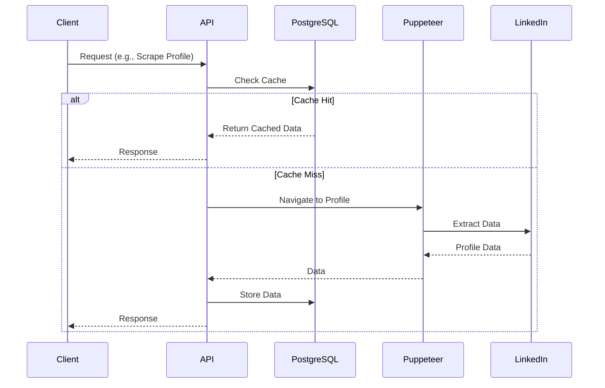
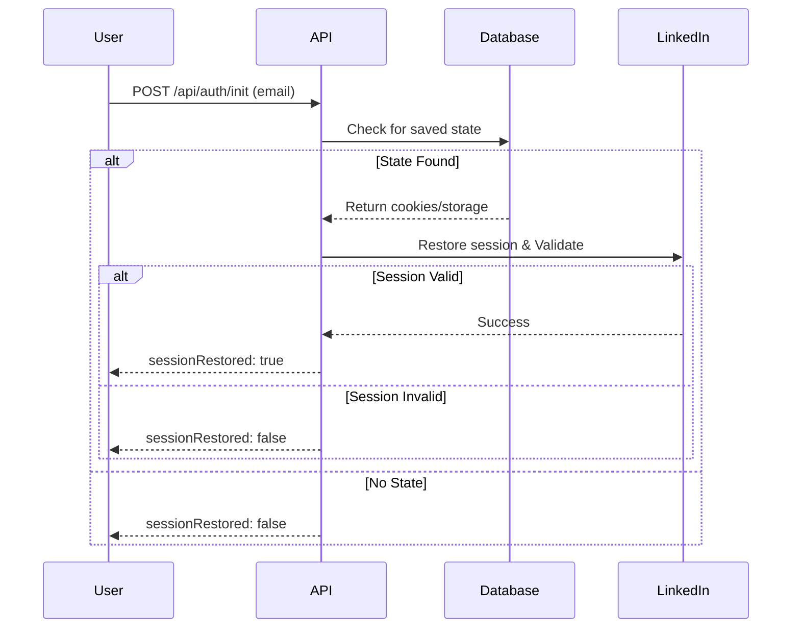

# LinkedIn Scraper API - Full Documentation

A powerful, containerized REST API for LinkedIn automation with TypeScript, Express, Puppeteer, and PostgreSQL caching.

## Table of Contents
1. [Project Overview](#project-overview)
2. [Architecture](#architecture)
3. [Getting Started](#getting-started)
4. [Configuration](#configuration)
5. [API Reference](#api-reference)
6. [n8n Integration](#n8n-integration)
7. [Development Guide](#development-guide)
8. [Troubleshooting & Best Practices](#troubleshooting--best-practices)

---

## Project Overview

This project provides a robust API for automating LinkedIn interactions. It is built to be easily deployed using Docker and integrates seamlessly with n8n for workflow automation.

### Key Features
- ✅ **Authentication**: Secure session-based login with browser state persistence.
- ✅ **Browser State Persistence**: Save cookies/storage to avoid repeated logins and CAPTCHAs.
- ✅ **Profile Scraping**: Extract comprehensive profile data (name, title, about, experience, etc.).
- ✅ **PostgreSQL Caching**: High-performance caching for profiles and messages.
- ✅ **Connection Requests**: Automated connection management with personalized notes.
- ✅ **Messaging**: List, read, and send messages. Includes real-time monitoring.
- ✅ **Search**: Find LinkedIn users by keywords.
- ✅ **Dockerized**: Easy deployment with Docker/Podman.
- ✅ **n8n Integration**: Custom nodes for drag-and-drop workflow building.
- ✅ **Premium UI Support**: Works with both standard and Premium LinkedIn interfaces.
- ✅ **CAPTCHA Solving**: Optional integration with 2Captcha for automated solving.

### Technology Stack
- **Backend**: Node.js, Express.js, TypeScript
- **Scraping**: Puppeteer (with `puppeteer-real-browser` for anti-detection)
- **Database**: PostgreSQL 15 (caching layer)
- **Logging**: Winston
- **Containerization**: Docker/Podman
- **Workflow Automation**: n8n
- **API Testing**: Bruno

---

## Architecture

### System Overview
```mermaid
graph LR
    Client[Client (n8n/curl/Postman)] --> API[Express API]
    API --> Service[LinkedInService]
    Service --> Puppeteer[Puppeteer]
    Puppeteer --> LinkedIn[LinkedIn]
    Service --> Cache[(PostgreSQL Cache)]
```

### Core Components

1.  **Express Server** (`src/server.ts`): Handles REST API requests, CORS, and error handling.
2.  **LinkedInService** (`src/services/LinkedInService.ts`): The core business logic. It uses Puppeteer to interact with LinkedIn's DOM directly, ensuring full control and adaptability to UI changes.
3.  **SessionManager** (`src/services/SessionManager.ts`): Manages browser instances and pages, handling UUID-based sessions with auto-cleanup.
4.  **CacheService** (`src/services/CacheService.ts`): Interacts with PostgreSQL to store and retrieve scraped profiles and conversation history.
5.  **BrowserStateService** (`src/services/BrowserStateService.ts`): Manages persistence of cookies, localStorage, and sessionStorage.

### Data Flow


---

## Getting Started

### Prerequisites
- Docker and Docker Compose (recommended)
- **OR** Node.js v16+ and Chrome/Chromium (for local dev)
- LinkedIn account credentials
- PostgreSQL (if running locally without Docker)

### Installation Methods

#### Method 1: Docker Deployment (Recommended)

This method sets up the API, PostgreSQL database, and n8n in a unified network.

1.  **Clone the repository**
    ```bash
    git clone <repository-url>
    cd n8n-linkedin-api
    ```

2.  **Prepare n8n Custom Nodes**
    Create the directory and ensure compiled nodes are present (see [n8n Integration](#n8n-integration) for details).
    ```bash
    mkdir -p n8n_custom_nodes
    # (Build and copy custom nodes here)
    ```

3.  **Configure Environment**
    Create a `.env` file:
    ```bash
    cp .env.example .env
    ```
    Edit `.env` with your credentials:
    ```env
    LINKEDIN_EMAIL=your_email@example.com
    LINKEDIN_PASSWORD=your_password
    # Database settings are auto-configured for Docker
    ```

4.  **Start Services**
    ```bash
    docker-compose up -d
    ```

5.  **Access Services**
    - **API**: `http://localhost:8080`
    - **n8n**: `http://localhost:5678`
    - **PostgreSQL**: `localhost:5432`

#### Method 2: Local Development

1.  **Install Dependencies**
    ```bash
    npm install
    ```

2.  **Setup Database**
    Ensure you have a PostgreSQL database running and update `.env` with connection details.

3.  **Start Server**
    ```bash
    npm run dev
    ```

---

## Configuration

### Environment Variables

| Variable | Description | Default |
|----------|-------------|---------|
| `PORT` | API server port | `3000` (local) / `8080` (docker) |
| `NODE_ENV` | Environment | `development` |
| `LINKEDIN_EMAIL` | LinkedIn email | - |
| `LINKEDIN_PASSWORD` | LinkedIn password | - |
| `DB_HOST` | Database host | `localhost` |
| `DB_PORT` | Database port | `5432` |
| `DB_USER` | Database user | `postgres` |
| `DB_PASSWORD` | Database password | `postgres` |
| `DB_NAME` | Database name | `linkedin` |
| `CAPTCHA_API_KEY` | 2Captcha API Key | - |

### CAPTCHA Integration (Optional)

The system can automatically solve LinkedIn's reCAPTCHA v2 challenges using [2Captcha](https://2captcha.com).

1.  **Get API Key**: Sign up at 2Captcha and get your key.
2.  **Configure**: Add to `.env`:
    ```env
    CAPTCHA_API_KEY=your_actual_api_key_here
    ```
3.  **Usage**: The system will automatically detect and solve CAPTCHAs during login.

### Browser State Persistence

Avoid repeated logins and CAPTCHAs by saving browser state.

**First Login (Saves State):**
```bash
POST /api/auth/login
{
  "sessionId": "...",
  "email": "your.email@example.com",
  "password": "your_password"
}
```

**Subsequent Sessions (Restores State):**
```bash
POST /api/auth/init
{
  "email": "your.email@example.com"
}
```
If `sessionRestored: true` is returned, you are ready to go without logging in again.

### Session Restoration Flow



---

## API Reference

### Authentication

#### Initialize Session
`POST /api/auth/init`
- **Body**: `{ "email": "optional@email.com" }`
- **Response**: `{ "sessionId": "uuid", "sessionRestored": boolean }`

#### Login
`POST /api/auth/login`
- **Body**: `{ "sessionId": "uuid", "email": "...", "password": "..." }`
- **Response**: `{ "success": true, "message": "Login successful" }`

#### Logout
`DELETE /api/auth/logout`
- **Body**: `{ "sessionId": "uuid" }`

### Profile Operations

#### Scrape Profile
`POST /api/profile/scrape`
- **Body**: `{ "sessionId": "uuid", "url": "https://www.linkedin.com/in/..." }`
- **Response**: Full profile data (JSON).

#### Visit Profile
`POST /api/profile/visit`
- **Body**: `{ "sessionId": "uuid", "url": "..." }`
- **Effect**: Visits the profile (appearing in their "Who viewed your profile").

#### Get Profile Views
`GET /api/profile/views?sessionId=uuid`
- **Response**: List of people who viewed your profile.

### Connections

#### Send Connection Request
`POST /api/connection/connect`
- **Body**: 
  ```json
  {
    "sessionId": "uuid",
    "url": "https://www.linkedin.com/in/...",
    "message": "Optional personalized note"
  }
  ```
- **Note**: Automatically handles both Standard and Premium UI flows.

### Messaging

#### List Conversations
`GET /api/messages/conversations?sessionId=uuid`

#### Read Conversation
`GET /api/messages/conversation`
- **Params**: 
  - `sessionId`: UUID
  - `conversationUrl`: Full thread URL
  - `profileUrl`: (Optional) For caching
  - `forceRefresh`: (Optional) `true` to bypass cache
- **Response**: Array of messages.

#### Send Message
`POST /api/messages/send`
- **Body**: `{ "sessionId": "uuid", "conversationUrl": "...", "message": "..." }`

#### Start Monitoring
`POST /api/messages/monitoring/start`
- **Body**: `{ "sessionId": "uuid" }`
- **Effect**: Opens a separate tab to watch for new messages in real-time.

### Search

#### Search People
`POST /api/search/people`
- **Body**: `{ "sessionId": "uuid", "keywords": "software engineer" }`

---

## n8n Integration

The project includes custom n8n nodes to make workflow building easier.

### Installation in Docker
1.  **Compile Nodes**: Ensure TypeScript nodes in `n8n_custom_nodes` are compiled to JS.
2.  **Mount Volume**: The `docker-compose.yml` mounts `./n8n_custom_nodes` to `/home/node/.n8n/custom/n8n_custom_nodes`.
3.  **Restart n8n**: `docker-compose restart n8n`.

### Available Nodes
- **LinkedIn Login**: Init, Login, Logout.
- **LinkedIn Profile**: Scrape, Visit, Get Views.
- **LinkedIn Connection**: Send Request.
- **LinkedIn Messaging**: List, Read, Send.
- **LinkedIn Search**: Search People.

### Configuration in n8n
1.  Create a **LinkedIn API Credential**.
2.  **Base URL**: `http://api:8080` (Internal Docker network address).
3.  **Email/Password**: Optional if set in API env.

---

## Development Guide

### Project Structure
```
src/
├── routes/             # API route handlers
├── services/           # Business logic (LinkedInService, etc.)
├── utils/              # Utilities (DOM functions, Logger)
├── types/              # TypeScript definitions
└── server.ts           # Entry point
```

### Custom Implementation Details
This project uses a custom Puppeteer implementation instead of third-party libraries to ensure:
- **Full Control**: Direct DOM manipulation.
- **Resilience**: Custom selectors for Standard and Premium UIs.
- **Anti-Detection**: Uses `puppeteer-real-browser`.

### Testing
- **Run Tests**: `npm test`
- **Watch Mode**: `npm run test:watch`
- **Coverage**: `npm run test:coverage`

---

## Troubleshooting & Best Practices

### Common Issues
- **Browser doesn't open**: Ensure Chrome/Chromium is installed (or use Docker).
- **Login Fails**: Check credentials. If 2FA is requested, you may need to handle it manually in the browser window (if running locally) or use a saved session.
- **n8n Connection Error**: Ensure n8n is using `http://api:8080` to talk to the API container, not `localhost`.

### Rate Limiting
To avoid being banned by LinkedIn:
- Wait 3-5 seconds between profile scrapes.
- Limit connection requests to ~20-50 per day.
- Limit profile scrapes to ~100-200 per day.

### Security
- Never commit `.env` files.
- Use the Docker network isolation to protect the API.
- Regularly clean up old sessions.
